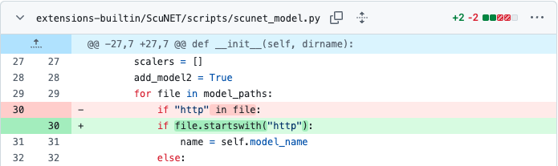
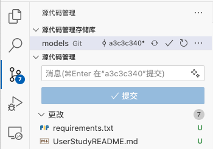

# 用户实验介绍

# 任务介绍
我们注意到当前仓库中存在一些不够安全高效的代码，请帮助我们进行改进。在判断一个字符串是否以 XX 开头时，当前代码使用的判断是：
```python
if "XX" in s:
    # ...
```
请修改为：
```python
if s.startswith("XX"):
    # ...
```
首个编辑发生在 [`extensions-builtin/ScuNET/scripts/scunet_model.py`](extensions-builtin/ScuNET/scripts/scunet_model.py) 文件中，如图所示:



请你在完成所示的修改后，继续对项目进行 **另外 7 处** 修改。你可以打开源代码管理工具，查看修改的数量，确保你确实完成了 8 处修改，如图所示：



如果你觉得修改的次数不够，可以继续修改，直到实现编辑目标（即通过 [验证修改](#验证修改) 中的测试）

# 验证修改
请运行以下命令验证修改：
```bash
python -m test.test
```

当修改正确时，测试会输出以下信息：


